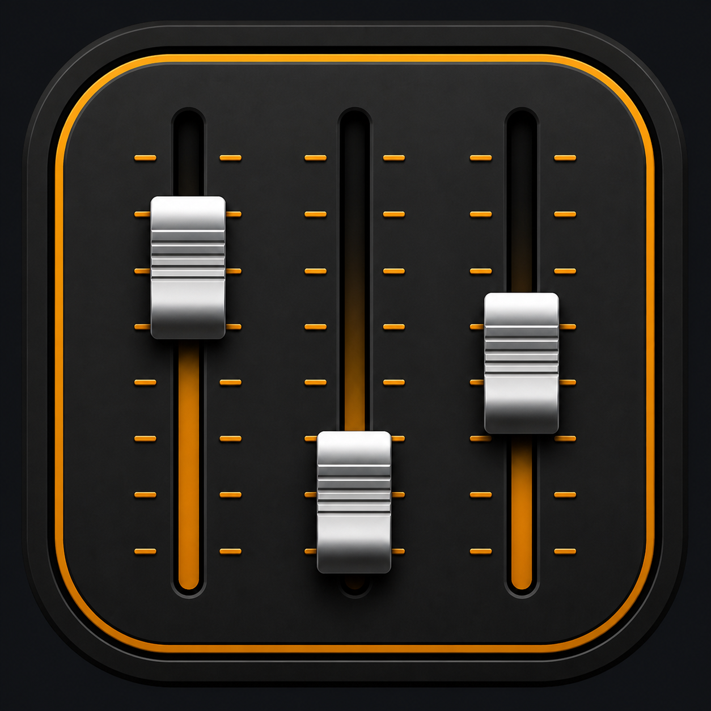
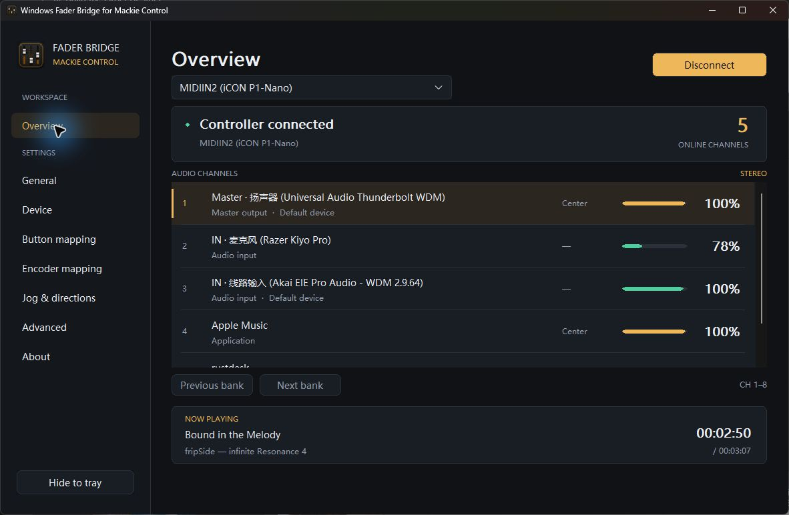

# Windows Fader Bridge for Mackie Control

Control the Windows audio mixer from a Mackie Control / MCU-compatible MIDI controller.

**[Download v1.0.0](https://github.com/lindelea/windows-fader-bridge-mackie/releases/latest)**

[简体中文使用手册](docs/USER_GUIDE.zh-CN.md) ・ [English User Guide](docs/USER_GUIDE.en.md) ・ [日本語ユーザーガイド](docs/USER_GUIDE.ja.md)

Use motor faders, encoders and buttons for Windows output devices, input devices and individual applications. The app includes configurable button, encoder and Jog/Move/Zoom assignments, live meters and media information.

Requirements: Windows 11 x64 and a controller with Mackie Control / MCU mode. No Avid software is required. iCON P1-Nano has been physically verified; other MCU controllers may differ in their optional controls and displays.

This repository is for downloads and user documentation. The corresponding v1.0.0 source is available in the [development project](https://github.com/lindelea/windows-fader-bridge/tree/v1.0.0). Licensed under [MPL 2.0](LICENSE). Mackie Control and iCON are trademarks of their respective owners; this independent project is not affiliated with or endorsed by them.
